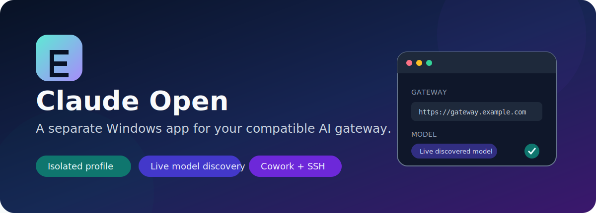
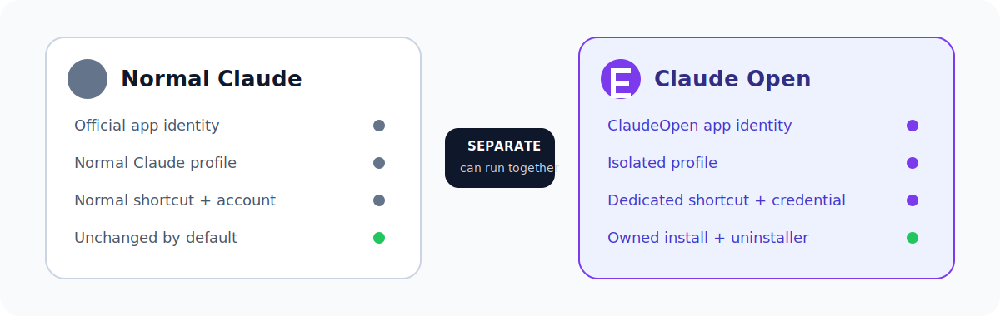

<div align="center">
  

  # Claude Open for Windows

  **Your gateway. Every compatible model. A separate desktop profile.**

  [](docs/INSTALL.md)
  [](https://github.com/aliziad24/claude-open/actions/workflows/ci.yml)
  [](LICENSE)
  [](docs/PRIVACY.md)

  [Install](#quick-start) · [User guide](docs/USER-GUIDE.md) · [Gateway compatibility](docs/GATEWAYS.md) · [Security](SECURITY.md) · [AI installer skill](skills/install-claude-open/SKILL.md)
</div>

Claude Open runs the official Anthropic-signed Claude Desktop client with an isolated Windows identity and profile, connected to a user-supplied compatible API gateway. It can run alongside normal Claude without using normal Claude's conversations, settings, credentials, or Start-menu identity.

> [!IMPORTANT]
> Claude Open is an independent community project. It is not affiliated with, sponsored by, approved by, or endorsed by Anthropic. Claude and Anthropic are trademarks of Anthropic PBC.

## What you get

| Capability | Claude Open behavior |
|---|---|
| Separate app | Dedicated **Claude Open** identity, Start icon, install directory, profile, and credential target |
| Bring your gateway | First-run base URL, authentication style, and API key fields |
| All compatible models | Live `/v1/models` discovery; no private or user-specific catalog in source |
| Reasoning effort | Model-specific controls appear only after the gateway verifies support |
| Cowork and SSH | Current Claude surfaces plus safe setup and functional verification guidance |
| Usage widget | Secret-free local session token/context telemetry |
| Mobile companion | Opt-in paired PWA with resumable streaming through a private HTTPS tunnel |
| No developer setup | Bundled Node.js runtime; no Node, npm, Git, or SDK required |
| Claude optional | If official Claude is absent, setup obtains it from its official Windows source |

## Quick start

1. Download and extract `ClaudeOpen-bootstrap.zip` from the [latest release](https://github.com/aliziad24/claude-open/releases/latest).
2. Open PowerShell in the extracted folder and run:

   ```powershell
   powershell -NoProfile -ExecutionPolicy Bypass -File .\Install-ClaudeOpen.ps1
   ```

3. Open **Claude Open** from its dedicated Start-menu icon.
4. Enter your gateway root URL and API key directly in Control Center, then select **Save Configuration**.
5. Select **Verify Gateway**, choose a discovered model and verified effort, then select **Launch Claude Open**.

Claude Desktop does not need to be installed first. If it already exists, setup leaves that installation and its profile unchanged by default. See [installation](docs/INSTALL.md) for a custom drive, Cowork prerequisites, update, and uninstall options.

Agents can follow the repository's [Install Claude Open skill](skills/install-claude-open/SKILL.md) to inspect, install, configure, verify, diagnose, or remove the app without asking for secrets.

### Optional mobile companion

Enable **Mobile companion** in Control Center, save, launch, and select **Mobile setup**. The companion provides a phone-friendly installable web app with live models, verified effort choices, local usage, cancellable streaming, and automatic catch-up after network interruptions.

It binds only to loopback and is intentionally unreachable from the LAN. Use a trusted private HTTPS tunnel such as Tailscale Serve; never router-forward or publicly expose the companion port. See [Remote Companion](docs/REMOTE-COMPANION.md).

## Separate from normal Claude

<div align="center">
  
</div>

Both applications can be installed and opened independently. Claude Open copies the current official runtime into its own owned directory, preserves the signed `claude.exe` and `app.asar` unchanged, and activates it using a distinct sparse MSIX identity and isolated profile. Update and uninstall operations are scoped to Claude Open ownership markers.

Read the exact boundaries in [isolation and coexistence](docs/ISOLATION.md).

## Gateway compatibility

Claude Open supports gateways with `/v1/models` discovery and at least one compatible inference route:

- Anthropic Messages: `/v1/messages`
- OpenAI Chat Completions: `/v1/chat/completions`
- OpenAI Responses: `/v1/responses`

Remote gateway URLs must use HTTPS. The API key is stored in Windows Credential Manager. The official client receives only a random loopback URL and a per-run local token; it never receives the upstream gateway key.

Models are discovered at runtime. Non-chat models and models without a safe route are excluded. Reasoning controls appear only when current gateway behavior verifies them. See [models and effort](docs/MODELS-EFFORT.md).

## Privacy and security

- No API key, private gateway URL, conversation, SSH host, private key, account ID, local profile, or live test capture belongs in source or releases.
- Normal Claude's profile is not read, copied, changed, or deleted.
- The adapter binds to a random loopback port and requires per-run client and diagnostics tokens.
- The installer verifies its release manifest and the copied client's Anthropic Authenticode signature.
- Version-checked patches apply only to copied loose renderer assets. If an official build does not match exactly, installation aborts and rolls back.
- A per-release signing key is destroyed during release creation; uninstall removes the recorded trusted public certificate.

Review [privacy](docs/PRIVACY.md), [security invariants](SECURITY.md), and [publication/trademark considerations](docs/PUBLICATION.md) before redistribution.

## Documentation

| Guide | Purpose |
|---|---|
| [User guide](docs/USER-GUIDE.md) | Configure, launch, choose models, use effort, Cowork, SSH, usage, update, and uninstall |
| [Installation](docs/INSTALL.md) | Requirements, standard/custom installs, rollback, and removal |
| [Architecture](docs/ARCHITECTURE.md) | Launcher, adapter, profile, identity, and runtime boundaries |
| [Gateway guide](docs/GATEWAYS.md) | Required endpoints and authentication styles |
| [Troubleshooting](docs/TROUBLESHOOTING.md) | Diagnose launch, gateway, model, Cowork, and SSH failures |
| [Isolation](docs/ISOLATION.md) | How normal Claude and Claude Open coexist |
| [Remote Companion](docs/REMOTE-COMPANION.md) | Secure mobile pairing, PWA installation, reconnect behavior, and limits |

## Build and verify

Maintainer requirements: Windows, Node.js 20+, npm, .NET Framework x64 C# compiler, and Windows SDK packaging/signing tools.

```powershell
npm ci
npm test
npm run verify:release:selftest
npm run verify:release:full
npm run build:release
powershell -NoProfile -ExecutionPolicy Bypass -File .\scripts\verify-release.ps1 -Path .\dist\ClaudeOpen-bootstrap
```

The bootstrap release contains no Anthropic application files. The installer obtains those files from the user's official Windows package at install time.

## License and trademarks

Original Claude Open source is available under the [MIT License](LICENSE). Third-party product names are used only to describe compatibility. No Anthropic software, logo, or trademark license is granted with this repository.
